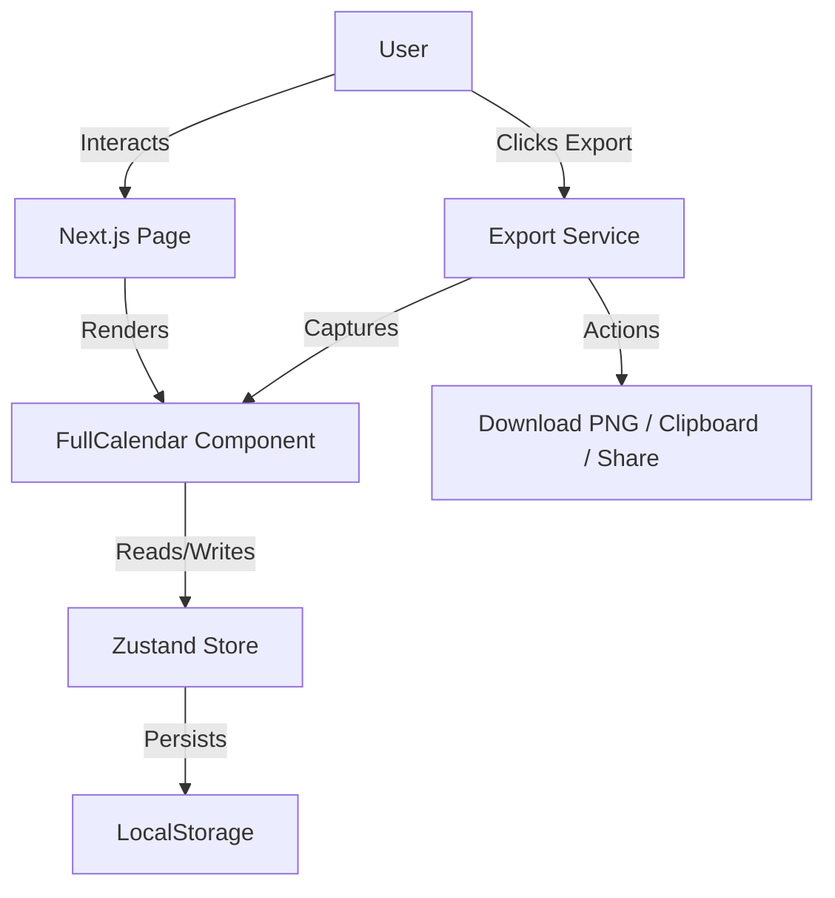

# Technical Design Document: LightShift

## 1. Architecture Overview

### 1.1 Tech Stack
- **Framework:** Next.js 14+ (App Router)
- **Language:** TypeScript
- **Styling:** Tailwind CSS 4 (with CSS Container Queries)
- **State Management:** Zustand (with `persist` middleware for localStorage)
- **Calendar UI:** FullCalendar (React)
    - `@fullcalendar/react`
    - `@fullcalendar/daygrid`
    - `@fullcalendar/timegrid`
    - `@fullcalendar/interaction`
- **Export:** `html-to-image` (to capture modern CSS colors and gradients)

### 1.2 System Diagram (Logical)


---

## 2. Project Structure

```text
src/
├── app/
│   ├── globals.css          # Tailwind 4 directives + FullCalendar overrides
│   ├── layout.tsx           # Root layout (Metadata, Geist Fonts)
│   └── page.tsx             # Main View (Sidebar + Calendar Layout)
├── components/
│   ├── CalendarWrapper.tsx  # FullCalendar React Component with responsive logic
│   ├── CreateShiftModal.tsx # Modal for adding new shifts with autocomplete
│   ├── StaffSidebar.tsx     # Staff List UI with Inline Editing + Weekly Stats
│   ├── ExportControls.tsx   # Share & Export functionality (Download, Copy, Share)
│   └── __tests__/           # Component unit tests (Jest + RTL)
├── store/
│   ├── useStore.ts          # Zustand Store (AppState, Actions, Persistence)
│   └── __tests__/           # Store logic and conflict validation tests
├── lib/
│   ├── utils/
│   │   ├── calendarUtils.ts # Scheduling Algorithms (Conflict, Color, Weekly Stats)
│   │   ├── validation.ts    # Zod Schemas (Staff, Shift, Runtime Validation)
│   │   └── __tests__/       # Utility function tests
│   └── services/
│       └── exportService.ts # Image Generation Logic (html-to-image)
└── types/
    └── index.ts             # Shared TypeScript Interfaces
```

---

## 3. Data Model & State Management

### 3.1 Core Entities
We use Zod for runtime validation and TypeScript for static typing.

```typescript
type ID = string; // UUID v4

interface Staff {
  id: ID;
  name: string;
  color: string; // Hex, HSL, or OKLCH
}

interface Shift {
  id: ID;
  staffId: ID;
  start: string; // ISO Date String (Local Time)
  end: string;   // ISO Date String (Local Time)
}
```

### 3.2 Zustand Store (`src/store/useStore.ts`)

#### State
| State | Description |
| :--- | :--- |
| **`staff`** | Array of all staff members. |
| **`shifts`** | Array of all scheduled shifts. |
| **`selectedStaffId`** | ID for filtering/highlighting all shifts of a specific staff member. |
| **`selectedShiftId`** | ID for keyboard-based deletion focus. |
| **`deletingStaffId`** | ID for pulsating delete-preview animation. |
| **`currentViewDate`** | Date object tracking the currently visible week in the calendar. |

#### Key Actions
- **`addStaff`**: Auto-assigns color from palette and creates new staff member.
- **`addShiftWithValidation`**: Checks for conflicts and enforces temporal logic (End > Start).
- **`updateShiftWithValidation`**: Validates and updates existing shift while checking for conflicts.
- **`deleteStaff`**: Performs a cascading delete (removes associated shifts).
- **`getDeleteStaffCount`**: Returns the number of shifts that will be deleted with a staff member.
- **`setSelectedStaffId`**: Sets staff filter and clears shift selection (mutual exclusivity).
- **`setSelectedShiftId`**: Sets shift selection and clears staff filter (mutual exclusivity).
- **`setCurrentViewDate`**: Updates the visible week date for weekly statistics calculation.
- **`clearAllSelections`**: Resets UI state for highlighting and selection.

---

## 4. Key Modules & Implementation Details

### 4.1 Calendar Wrapper (`src/components/CalendarWrapper.tsx`)
- **Responsive Logic**: Uses **CSS Container Queries** (`@container`) to decide whether to show full names, durations, or empty bars based on the event's horizontal width.
- **Drill-down**: Clicking a day in Month View automatically switches the calendar to Week View for that day.
- **Keyboard Interaction**: Listens for `Delete` or `Backspace` to remove `selectedShiftId`.
- **View Tracking**: Updates `currentViewDate` whenever the user navigates to a different week.

### 4.2 Staff Sidebar (`src/components/StaffSidebar.tsx`)
- **Weekly Statistics**: Displays shift count and total hours for each staff member for the currently visible week.
- **Dynamic Updates**: Stats automatically update when navigating between weeks or modifying shifts.
- **Format**: Shows "X shift(s) · Y.Yh this week" below each staff member's name.

### 4.3 Selection Behavior (Mutual Exclusivity)
- **Task vs. Staff Selection**: These two modes are mutually exclusive per PRD requirements:
  - Selecting a **shift** automatically clears any active **staff filter**.
  - Selecting a **staff member** automatically clears any selected **shift**.
- **Rationale**: Prevents confusion and ensures a clear, single focus mode.

### 4.4 Highlighting & Visual Feedback
- **Staff Highlight**: Dimming non-target shifts (`opacity: 0.15`, grayscale) when a staff member is selected for filtering.
- **Pulsating Preview**: High-visibility red pulse on shifts when their owner is being deleted.
- **Selection**: Black ring and brightness boost for the active shift.

### 4.5 Export Service (`src/lib/services/exportService.ts`)
- Leverages `html-to-image` for compatibility with Tailwind 4's `oklch` color space.
- Supports native sharing via `navigator.share` for mobile users.

---

## 5. Key Algorithms

### 5.1 Color Assignment
Rotates through a 8-color high-contrast palette first, then falls back to random HSL with fixed saturation/lightness.

### 5.2 Conflict Detection (Strict Blocking)
Shifts for the **same staff member** cannot overlap.
```typescript
// Logic: newStart < existingEnd && newEnd > existingStart
```

### 5.3 Weekly Statistics Calculation
Calculates shift count and total hours for a staff member within a specific week (Sunday to Saturday).
- **Week Range**: Uses `getWeekRange(referenceDate?)` to determine week boundaries.
- **Overlap Detection**: Counts shifts that overlap with the target week.
- **Hours Calculation**: Sums total duration in hours, rounded to 1 decimal place.

---

## 6. Technical Constraints & Edge Cases

- **LocalStorage Quota**: JSON footprint is minimized. Non-persistent UI states (modals, highlights) are excluded from the `persist` configuration.
- **Timezones**: All dates are stored as local ISO strings to ensure the user's intent is preserved regardless of system timezone shifts (common for "offline-first" shift scheduling).

---

## 7. Testing Strategy
Co-located tests in `__tests__` directories using **Jest** and **React Testing Library**.
- **Business Logic**: Tests for `isShiftConflict` and store state transitions.
- **UI Components**: Tests for modal visibility, sidebar filtering, and responsive label switching.
