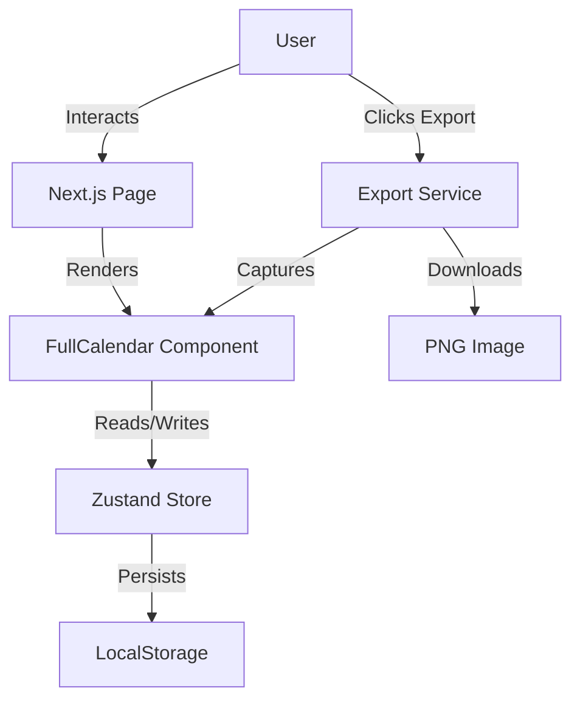

# Technical Design Document: LightShift

## 1. Architecture Overview

### 1.1 Tech Stack
- **Framework:** Next.js 14 (App Router)
- **Language:** TypeScript
- **Styling:** Tailwind CSS
- **State Management:** Zustand (with `persist` middleware for localStorage)
- **Calendar UI:** FullCalendar (React)
    - `@fullcalendar/react`
    - `@fullcalendar/daygrid`
    - `@fullcalendar/timegrid`
    - `@fullcalendar/interaction`
- **Export:** `html2canvas` (to capture the DOM element of the calendar)

### 1.2 System Diagram (Logical)


## 2. Data Model

### 2.1 Core Entities (TypeScript Interfaces)

```typescript
type ID = string; // UUID v4

interface Staff {
  id: ID;
  name: string;
  color: string; // Hex code or HSL string
  createdAt: string; // ISO Date String
}

interface Shift {
  id: ID;
  staffId: ID;
  start: string; // ISO Date String (Local Time) e.g., "2023-10-27T09:00:00"
  end: string;   // ISO Date String (Local Time)
  notes?: string;
}

// Store State
interface AppState {
  staff: Record<ID, Staff>;
  shifts: Record<ID, Shift>;
  selectedStaffId: ID | null;
  deletingStaffId: ID | null; // Track staff member currently targeted for deletion
  // Actions
  addStaff: (name: string) => Staff;
  updateStaff: (id: ID, updates: Partial<Staff>) => void;
  deleteStaff: (id: ID) => void;
  addShift: (shift: Omit<Shift, 'id'>) => void;
  updateShift: (id: ID, updates: Partial<Shift>) => void;
  deleteShift: (id: ID) => void;
  setSelectedStaffId: (id: string | null) => void;
  setSelectedShiftId: (id: string | null) => void;
  setDeletingStaffId: (id: string | null) => void;
  clearAllSelections: () => void;
}
```

### 2.2 Validation (Zod Schemas)
Validation logic should be separated from components.

```typescript
import { z } from 'zod';

export const StaffSchema = z.object({
  id: z.string().uuid(),
  name: z.string().min(1, "Name is required").max(50),
  color: z.string(),
});

export const ShiftSchema = z.object({
  id: z.string().uuid(),
  staffId: z.string().uuid(),
  start: z.string().datetime({ local: true }), // Allow local ISO strings
  end: z.string().datetime({ local: true }),
}).refine(data => new Date(data.end) > new Date(data.start), {
  message: "End time must be after start time",
  path: ["end"],
});
```

## 3. Key Algorithms

### 3.1 Color Assignment
When a new staff member is created, assign a color that is visually distinct from existing ones.
**Strategy:** Rotate through a fixed high-contrast palette first, then fallback to random HSL with fixed saturation/lightness.

```typescript
const PALETTE = [
  '#3B82F6', // Blue
  '#EF4444', // Red
  '#10B981', // Emerald
  '#F59E0B', // Amber
  '#8B5CF6', // Violet
  '#EC4899', // Pink
  '#06B6D4', // Cyan
  '#F97316', // Orange
];

function getNextColor(existingStaff: Staff[]): string {
  const usedColors = new Set(existingStaff.map(s => s.color));
  const available = PALETTE.find(c => !usedColors.has(c));
  if (available) return available;
  
  // Fallback: Random robust HSL
  return `hsl(${Math.floor(Math.random() * 360)}, 70%, 50%)`;
}
```

### 3.2 Conflict Detection (Strict Blocking)
Before adding or updating a shift, run this check. Note that conflicts are only checked against the **same staff member**; multiple different staff members are allowed to have overlapping shifts.

```typescript
function isShiftConflict(
  targetStaffId: ID, 
  newStart: Date, 
  newEnd: Date, 
  excludeShiftId?: ID // For updates, exclude self
): boolean {
  const staffShifts = getAllShiftsForStaff(targetStaffId);
  
  return staffShifts.some(shift => {
    if (shift.id === excludeShiftId) return false;
    const existingStart = new Date(shift.start);
    const existingEnd = new Date(shift.end);
    
    // Check overlap
    return newStart < existingEnd && newEnd > existingStart;
  });
}
```

## 4. Technical Constraints & Edge Cases

### 4.1 LocalStorage Limits
- **Quota:** Typically ~5MB.
- ** mitigation:** 
  - Minimize JSON footprint (e.g., don't store computed props).
  - Use `try/catch` around persistence. If quota exceeded, show a "Storage Full" toast and prevent new actions.

### 4.2 Browser Reliability
- **Private Browsing:** LocalStorage is cleared when tab closes. We should add a small "Data clears on close in Incognito" warning if detectable (hard to detect reliably, but we can warn generally about clearing cache).

## 5. Implementation Strategy
1.  **Setup:** Install Dependencies (`zustand`, `zod`, `clsx`, `tailwind-merge`, `lucide-react`, `fullcalendar` packages).
2.  **State:** Build the Zustand store with `persist` middleware.
3.  **UI Components:**
    - `CalendarWrapper`: Wraps FullCalendar with custom styling.
    - `StaffSidebar`: List of staff with Edit/Delete controls.
    - `AddShiftModal`: Form for creating ad-hoc shifts (if not using drag-create).
4.  **Integration:**
    - Wire up FullCalendar events (`eventDrop`, `eventResize`, `select`) to Store actions with validation middleware.
    - **Highlighting Logic:** 
        - **Staff Focus:** When `selectedStaffId` is set, non-target shifts are dimmed (`opacity: 0.3`). Target shifts receive a `staff-highlighted` class with a soft drop-shadow for elevation.
        - **Shift Selection:** When `selectedShiftId` is set, the shift pulses with a black ring and increased brightness to signify focus for keyboard actions (Delete).
    - **Deselection Behavior:** Clicking on the application background (empty sidebar space or empty calendar slots) triggers `clearAllSelections()`, resetting the view by removing all dimming and focus effects.
    - **Deletion Preview:** When `deletingStaffId` is set, apply a high-visibility pulsing red effect to all shifts belonging to that ID, helping the user visualize the scope of the cascading delete.
